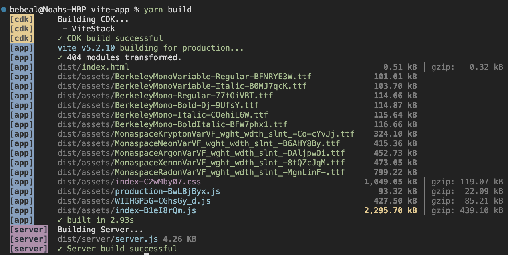
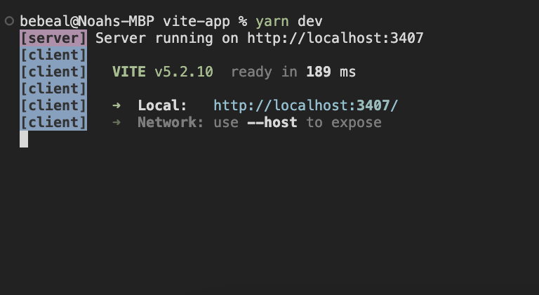

# gradient-guru

My personal site which I often change and perterb to learn new libraries, frameworks, and tools.

The plot was lost a long time ago, but the timeline so far has been:

react-script (react-router) -> next.js (app router) -> vite (react-router)

## Env Variables

Use `.env.example` as a template to fill out necessary environment variables which are required for various clients and services

## Build

```bash
yarn
yarn build
```

Output:



## Dev Server
  
```bash
yarn
yarn dev
```

Output:



## Dependencies

All the dependencies built into this project.

### Build Tools

- [Vite](https://vitejs.dev/) \[[Vite Repo](https://github.com/vitejs/vite)\] \[[Awesome Vite](https://github.com/vitejs/awesome-vite)\]
  - [vite.config.ts](./vite.config.ts): Vite config
  - [src/vite-env.d.ts](./src/vite-env.d.ts): Vite environment types
- [Node](https://nodejs.org/) \[[Node Repo](https://github.com/nodejs/node)\]
- [Yarn](https://yarnpkg.com/) \[[Yarn Repo](https://github.com/yarnpkg/yarn)\] \[[Yarn CLI](https://yarnpkg.com/cli)\]
- [TypeScript](https://www.typescriptlang.org/docs/) \[[TypeScript Repo](https://github.com/microsoft/TypeScript)\]

### Testing

- [Jest](https://github.com/jestjs/jest)
- [Vite Jest](https://github.com/vitejs/vite-plugin-react)

### Server & Deployement Infrastructure

- [AWS CDK](https://docs.aws.amazon.com/cdk/v2/guide/home.html)
- [AWS Amplify](https://docs.aws.amazon.com/amplify/latest/userguide/welcome.html)

### Vite Plugins

- [vite-tsconfig-paths](https://github.com/aleclarson/vite-tsconfig-paths/releases)
- [vite-plugin-svgr](https://github.com/pd4d10/vite-plugin-svgr/releases)

### Linting & Formatting

- [ESLint](https://github.com/eslint/eslint)
- [Prettier](https://github.com/prettier/prettier)

### Frontend Frameworks and Libraries

- [React](https://react.dev/) \[[React Repo](https://github.com/facebook/react)\]
- [Radix UI Primitives](https://radix-ui.com/) \[[Radix UI Repo](https://github.com/radix-ui)\]
- [Radix Themes](radix-ui.com/themes/docs) \[[Radix Themes Repo](https://github.com/radix-ui/themes)\]

### Routing

- [React Router](https://reactrouter.com/) \[[React Router Repo](https://github.com/remix-run/react-router)\]

### Styling

- [Tailwind CSS](https://github.com/tailwindlabs/tailwindcss)
  - [Tailwind CSS Docs](https://tailwindcss.com)
  - Plugins:
    - [tailwindcss-animate](https://github.com/jamiebuilds/tailwindcss-animate)
    - [@tailwindcss/typography](https://github.com/tailwindlabs/tailwindcss-typography)
    - [@tailwindcss/aspect-ratio](https://github.com/tailwindlabs/tailwindcss-aspect-ratio)
    - [tailwindcss-radix](https://github.com/ecklf/tailwindcss-radix)
- [Styled Components](https://github.com/styled-components)
  - [Styled Components Docs](https://styled-components.com/docs)

### Misc

- [react-query](https://tanstack.com/query/latest/docs/framework/react/overview) \[[react-query Repo](https://github.com/TanStack/query)\]
- [ag-grid](https://www.ag-grid.com/documentation/) [ag-grid Repo](https://github.com/ag-grid/ag-grid)
- [ag-charts](https://charts.ag-grid.com/) [ag-charts Repo](https://github.com/ag-grid/ag-charts)
- [tlraw](https://github.com/tldraw/tldraw)
  - [Tldraw Docs](https://tldraw.dev/docs)
- [tiptap](https://github.com/ueberdosis/tiptap)
  - [tiptap Docs](https://www.tiptap.dev/)
  - [tiptap templates](https://github.com/ueberdosis/tiptap-templates)
  - [sereneinserenade extensions](https://github.com/sereneinserenade?tab=repositories&q=tiptap&type=&language=&sort=)
- [yup](https://github.com/jquense/yup)
  - [yup Docs](https://github.com/jquense/yup)
- [react-query](https://github.com/TanStack/query)
  - [react-query Docs](https://tanstack.com/query/v3/docs/react/overview)
- [zustand](https://github.com/pmndrs/zustand)
  - [zustand Docs](https://docs.pmnd.rs/zustand/getting-started/introduction)
- [react-syntax-highlighter](https://github.com/react-syntax-highlighter/react-syntax-highlighter)
  - [vscDarkPlus](https://github.com/react-syntax-highlighter/react-syntax-highlighter/blob/b0d771441590ff06eda265488bbf011a0140fbf4/src/styles/prism/vsc-dark-plus.js)
- [plotly.js](https://github.com/plotly/plotly.js)
  - [plotly.js Docs](https://plotly.com/javascript/)
- [aceternity](https://www.aceternity.com/components)
- [framer-motion](https://github.com/framer/motion)
  - [framer-motion Docs](https://www.framer.com/motion/)
- [tsparticles](https://github.com/tsparticles/tsparticles)

## Assets

embed in `src/assets/`

### Icons

- [Carbon](https://github.com/carbon-design-system/carbon)
  - [Carbon Icon Docs](https://github.com/carbon-design-system/carbon)
- [Tldraw](https://github.com/tldraw/tldraw/tree/main/assets/icons/icon)
- [Lucide](https://github.com/lucide-icons/lucide)
  - [Lucide Icon Docs](https://lucide.dev/icons/)
- [Radix](https://github.com/radix-ui/icons)
  - [Radix Icon Docs](https://www.radix-ui.com/icons)
- [Logos](https://github.com/gilbarbara/logos)
- Weird/Dumb/Custom Icons

### Fonts

- [Berkeley Mono](https://berkeleygraphics.com/typefaces/berkeley-mono/)
- [Monaspace](https://github.com/githubnext/monaspace)
  - [Monaspace Docs](https://monaspace.githubnext.com/)
  - Variants:
    - [Argon](https://github.com/githubnext/monaspace/blob/main/fonts/variable/MonaspaceArgonVarVF%5Bwght%2Cwdth%2Cslnt%5D.ttf)
    - [Krypton](https://github.com/githubnext/monaspace/blob/main/fonts/variable/MonaspaceKryptonVarVF%5Bwght%2Cwdth%2Cslnt%5D.ttf)
    - [Neon](https://github.com/githubnext/monaspace/blob/main/fonts/variable/MonaspaceNeonVarVF%5Bwght%2Cwdth%2Cslnt%5D.ttf)
    - [Radon](https://github.com/githubnext/monaspace/blob/main/fonts/variable/MonaspaceRadonVarVF%5Bwght%2Cwdth%2Cslnt%5D.ttf)
    - [Xenon](https://github.com/githubnext/monaspace/blob/main/fonts/variable/MonaspaceXenonVarVF%5Bwght%2Cwdth%2Cslnt%5D.ttf)
- ["Tldrawish"](https://github.com/tldraw/tldraw/tree/main/assets/fonts)
- [Raleway](https://fonts.google.com/specimen/Raleway)

## Known Issues Tracker

- Warnings when running prettier format:
  - [prettier-plugin-sort-imports/issues/244](https://github.com/trivago/prettier-plugin-sort-imports/issues/244)

```txt
[warn] Ignored unknown option { importOrderSeparation: false }.
```

- ts-node cannot run mixed ESM and CJS modules:
  - [ts-node/issues/2110](https://github.com/TypeStrong/ts-node/issues/2110)
  - [ts-node/issues/2100](https://github.com/TypeStrong/ts-node/issues/2100)